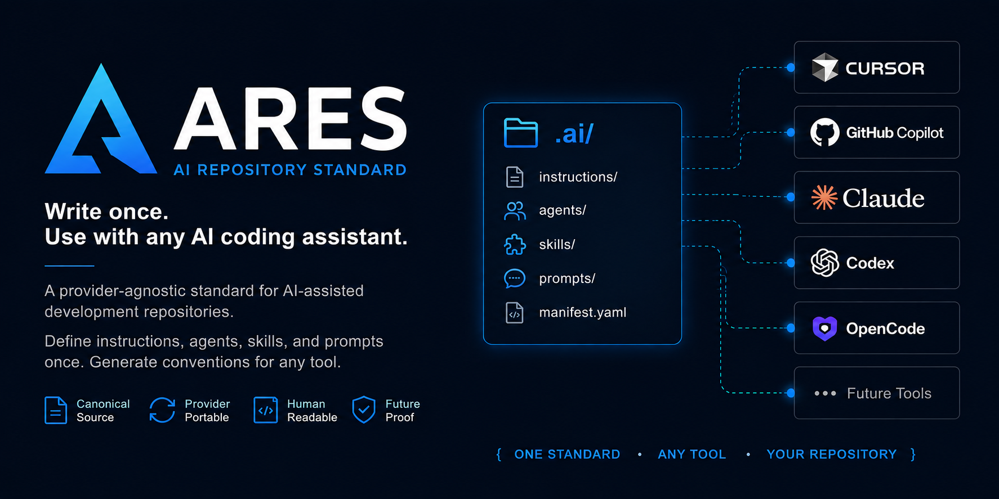
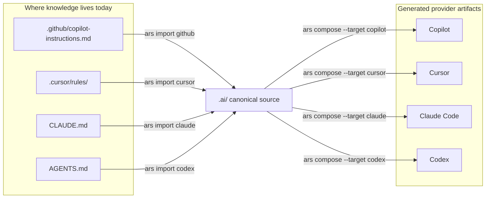
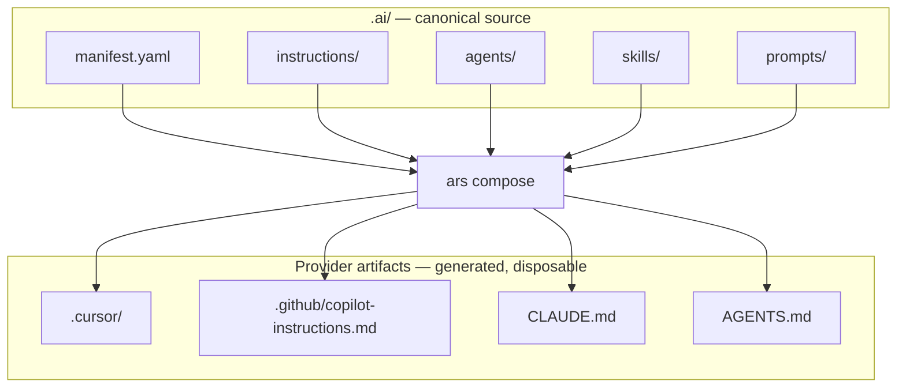

# ARES — AI Repository Standard (ARS)

> Portable repository knowledge for AI coding tools. One `.ai/` source → Cursor, Copilot, Claude Code, Codex.

[](LICENSE)
[](https://github.com/okfriansyah-moh/ares/releases/latest)

**Topics:** `ai` · `ai-coding` · `repository-standard` · `cursor` · `github-copilot` · `claude-code` · `codex` · `cli` · `developer-tools` · `standards` · `portability` · `golang` · `dot-ai` · `open-source` · `specification`

**Latest release:** [Download latest](https://github.com/okfriansyah-moh/ares/releases/latest) — binaries for macOS, Linux, and Windows

ARES is the reference implementation of ARS, the AI Repository Standard.



It lets a repository define durable AI coding knowledge once in `.ai/`, then generate provider-specific files for Cursor, GitHub Copilot, Claude Code, and OpenAI Codex.

The golden rule: delete generated provider files, run `ars compose`, and everything comes back from `.ai/`.

## When to use ARES

Write repository knowledge once in `.ai/`. Let `ars compose` and `ars import` keep every AI tool in sync.



### Scenarios

**1. You started with GitHub Copilot and want to move to Cursor**

Your team already invested in `.github/copilot-instructions.md`. Import it into `.ai/`, edit there, then compose Cursor artifacts. No rewrite from scratch.

```sh
ars import github
# refine .ai/instructions/, .ai/skills/, etc.
ars validate
ars compose --target cursor
```

**2. Your team uses all four providers**

Different engineers use different tools. Maintain one `.ai/` tree and compose each target when knowledge changes.

```sh
ars validate
ars compose --target cursor
ars compose --target copilot
ars compose --target claude
ars compose --target codex
```

**3. You are starting a new repository**

Scaffold `.ai/` on day one so provider files are always generated, never hand-maintained.

```sh
ars init
# add instructions, agents, skills, prompts under .ai/
ars validate
ars compose --target cursor   # or whichever tool you use first
```

**4. Knowledge is scattered across provider-owned files**

Rules live in `.cursor/`, instructions in `.github/`, and `CLAUDE.md` drifted months ago. Import each source into `.ai/`, reconcile conflicts, then compose everything from one place.

```sh
ars import cursor
ars import github --overwrite   # only when you intend to replace existing .ai/ files
ars import claude
ars validate
```

**5. You want CI to catch drift before merge**

Validate structure and references in CI. Optionally compose artifacts so generated files stay in sync with `.ai/`.

```sh
ars validate --json
ars compose --target cursor
```

**6. Someone deleted generated provider files**

That is expected. Generated artifacts are disposable; `.ai/` is the source of truth.

```sh
rm -rf .cursor/rules .github/copilot-instructions.md CLAUDE.md AGENTS.md
ars compose --target cursor
ars compose --target copilot
ars compose --target claude
ars compose --target codex
```

## Installation

### macOS and Linux (one-line installer)

No Go required:

```sh
curl -fsSL https://github.com/okfriansyah-moh/ares/raw/main/install.sh | bash
```

Then add to PATH if prompted:

```sh
echo 'export PATH="$HOME/.local/bin:$PATH"' >> ~/.zshrc && source ~/.zshrc
```

### Windows

The one-line installer is bash-only. On native Windows, use one of the options below.

**Download a release binary** (no Go required):

1. Open [GitHub Releases](https://github.com/okfriansyah-moh/ares/releases/latest).
2. Download `ars-windows-amd64.exe`.
3. Put it on your `PATH` (for example `%USERPROFILE%\.local\bin\ars.exe`).

PowerShell example:

```powershell
$installDir = "$env:USERPROFILE\.local\bin"
New-Item -ItemType Directory -Force -Path $installDir | Out-Null
Invoke-WebRequest `
  -Uri "https://github.com/okfriansyah-moh/ares/releases/latest/download/ars-windows-amd64.exe" `
  -OutFile "$installDir\ars.exe"
```

Then add `%USERPROFILE%\.local\bin` to your user `PATH` and verify:

```powershell
ars --version
```

**WSL**: if you use Windows Subsystem for Linux, run the macOS/Linux one-line installer inside your WSL shell.

### Go Install

Works on macOS, Linux, and Windows when Go is installed:

```sh
go install github.com/okfriansyah-moh/ares/cmd/ars@latest
```

### Docker

```sh
docker run --rm -v "$(pwd):/repo" ghcr.io/okfriansyah-moh/ares:latest compose --target cursor --root /repo
```

On Windows, use Docker Desktop and mount your repo path in the same way (for example `-v "%cd%:/repo"` in PowerShell).

### Homebrew

Coming soon:

```sh
brew install ars-standard/tap/ars
```

## Quick Start

```sh
ars init

# Edit canonical repository knowledge:
# .ai/manifest.yaml
# .ai/instructions/
# .ai/agents/
# .ai/skills/
# .ai/prompts/

ars validate
ars compose --target cursor
```

## Command Reference

| Command                                             | Description                               |
| --------------------------------------------------- | ----------------------------------------- |
| `ars init [--root <path>] [--force]`                | Scaffold `.ai/`.                          |
| `ars validate [--root <path>] [--json]`             | Validate `.ai/` structure and references. |
| `ars compose --target <target> [--root <path>]`     | Generate provider artifacts from `.ai/`.  |
| `ars import <source> [--root <path>] [--overwrite]` | Import provider artifacts into `.ai/`.    |

## Provider Support

| Provider       | Compose target | Output                               |
| -------------- | -------------- | ------------------------------------ |
| Cursor         | `cursor`       | `.cursor/rules/`, `.cursor/prompts/` |
| GitHub Copilot | `copilot`      | `.github/copilot-instructions.md`    |
| Claude Code    | `claude`       | `CLAUDE.md`                          |
| OpenAI Codex   | `codex`        | `AGENTS.md`                          |

| Provider artifact                 | Import source |
| --------------------------------- | ------------- |
| `.github/copilot-instructions.md` | `github`      |
| `.cursor/rules/*.mdc`             | `cursor`      |
| `CLAUDE.md`                       | `claude`      |
| `AGENTS.md`                       | `codex`       |

## Architecture

```text
.ai/
  manifest.yaml
  instructions/
  agents/
  skills/
  prompts/
      |
      v
   ars compose
      |
      +--> .cursor/
      +--> .github/copilot-instructions.md
      +--> CLAUDE.md
      +--> AGENTS.md
```



ARES is a local, file-based CLI. It is not an agent runtime, provider router, workflow engine, memory system, database-backed app, web app, or marketplace.

## Repository Format

```text
.ai/
  manifest.yaml                 project metadata
  instructions/<name>.md         repository-wide instructions
  agents/<name>/AGENT.md         agent role, responsibilities, uses, boundaries
  skills/<name>/SKILL.md         reusable knowledge
  prompts/<name>.md              reusable prompt templates
```

See [SPEC.md](SPEC.md) for the full ARS v1 specification.

## Contributing

Read [SPEC.md](SPEC.md), [docs/architecture.md](docs/architecture.md), and [docs/PLAN.md](docs/PLAN.md) before changing behavior. Keep `.ai/` as the canonical source of repository knowledge and provider files as generated artifacts.
